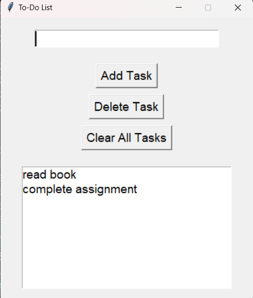

# ✅ To-Do List Application (Python GUI)

A simple and interactive To-Do List desktop application built using **Python** and **Tkinter**. This app helps you manage tasks efficiently with a clean GUI and responsive controls.

---

## 🚀 Features

- ➕ Add a new task
- 🗑️ Delete a selected task
- 🧹 Clear all tasks
- 📝 Real-time updates to the list
- 📦 Lightweight, runs locally without internet

---

## 📸 Screenshot

---

## 🧰 Technologies Used

| Tech         | Description               |
|--------------|----------------------------|
| 🐍 Python     | Core programming language |
| 🖼️ Tkinter    | GUI development framework |
| 📦 OOP        | (Optional) for future scaling |

---

## 📁 Project Structure

